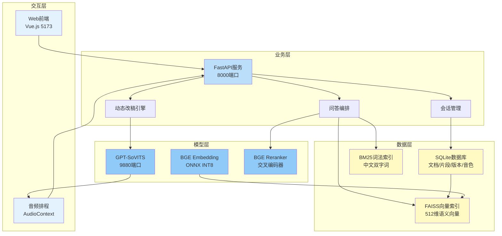
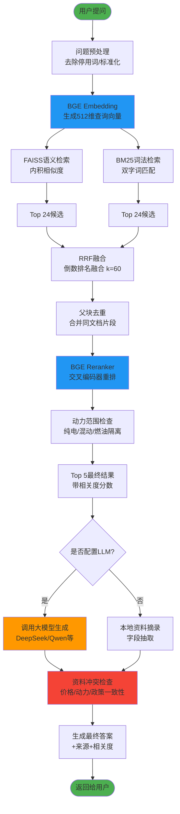
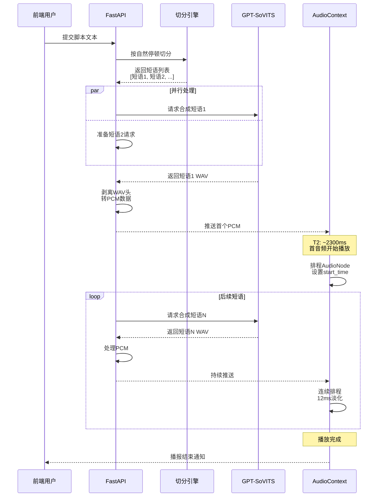
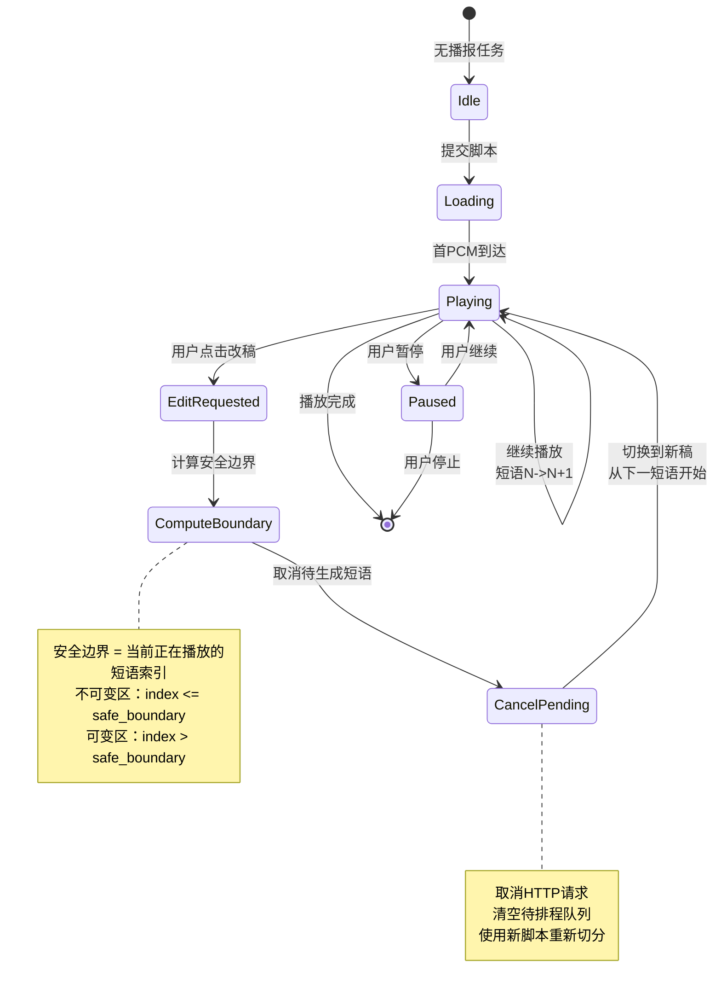
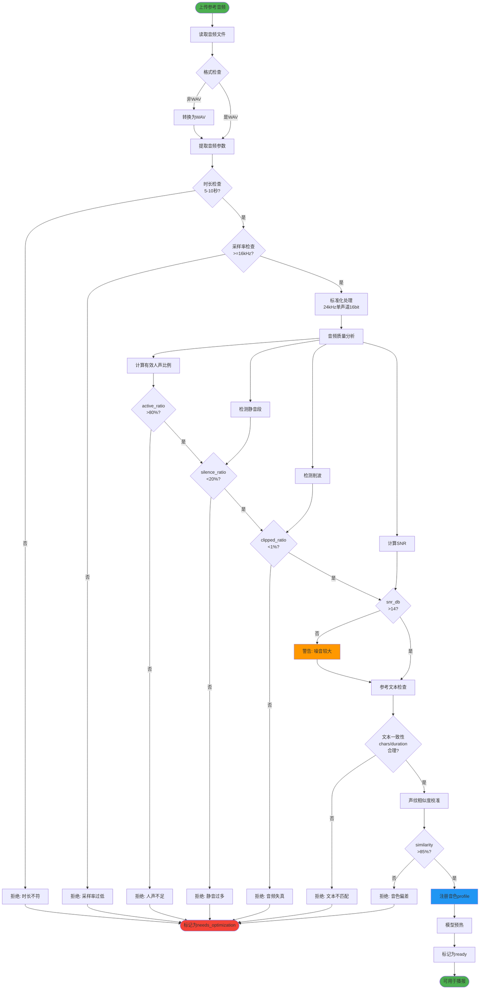
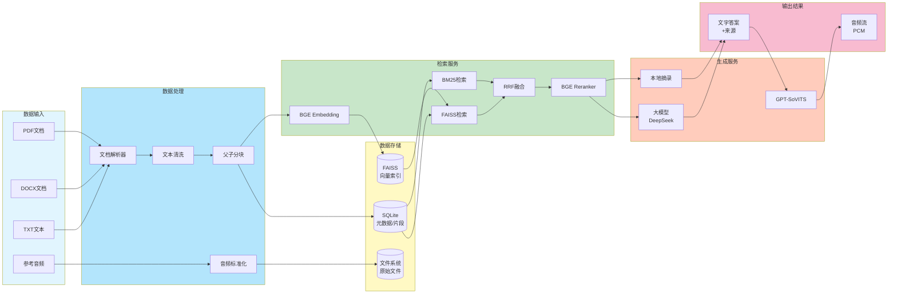
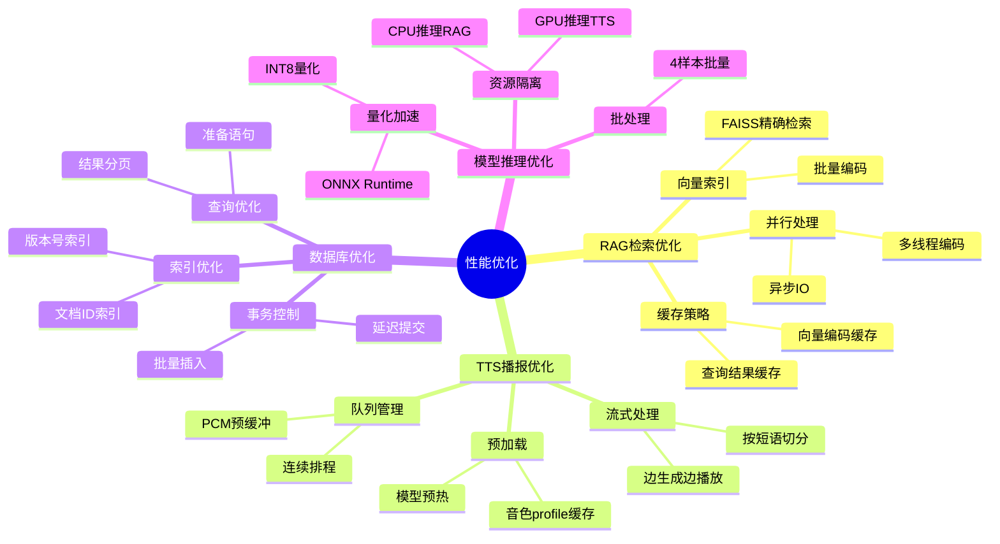

# 汽车直播智能体 - 架构图与流程图

## 1. 系统整体架构图

## 2. RAG检索Pipeline详细流程

## 3. 流式TTS播报时序图

## 4. 动态改稿状态机

## 5. 语音克隆质量门禁流程

## 6. 数据流向全景图

## 7. 性能优化策略流程

## 使用说明

这些Mermaid图表可以：
1. 直接在支持Mermaid的Markdown编辑器中渲染（如Typora、VS Code + Mermaid插件）
2. 使用在线工具转换为PNG/SVG（如mermaid.live）
3. 集成到文档和PPT中

每个图表都经过精心设计，展示了系统的不同维度。
